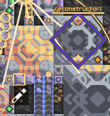
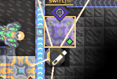

# Scripts

(:toc)


## Auto Upgrader

**Required setup:**
- 1 Switch
- 1 Upgrade station (Level 2,3 or 4)



**Script:**
<details>
<summary>Expand here</summary>
<p>

```
sensor result switch1 @enabled
jump 9 notEqual result true
ubind @flare
sensor x reconstructor1 @x
sensor y reconstructor1 @y
sensor p reconstructor1 @progress
jump 9 greaterThanEq p 0.01
ucontrol move x y 0 0 0
ucontrol payEnter x y 0 0 0
end
``` 


</p>
</details>

---
## Attack controller

**Required setup:**
- 1 Switch
  


**Script:**
<details>
<summary>Expand here</summary>
<p>

```
sensor result switch1 @enabled
jump 30 notEqual result true
ubind @gamma
sensor result @unit @controlled
sensor x @unit @x
sensor y @unit @y
sensor sx @unit @shootX
sensor sy @unit @shootY
sensor p @unit @progress
sensor s @unit @shooting
jump 30 notEqual result @ctrlPlayer
ubind @antumbra
ucontrol approach sx sy 5 0 0
jump 15 notEqual s 1
ucontrol target sx sy 1 0 0
ubind @zenith
ucontrol approach sx sy 5 0 0
jump 20 notEqual s 1
ucontrol target sx sy 5 0 0
ucontrol boost 1 sy 1 0 0
ubind @horizon
ucontrol approach sx sy 5 0 0
jump 25 notEqual s 1
ucontrol target sx sy 5 0 0
ucontrol boost 1 sy 1 0 0
ubind @flare
ucontrol approach sx sy 5 0 0
jump 30 notEqual s 1
ucontrol target sx sy 5 0 0
ucontrol boost 1 sy 1 0 0
end
```

</p>
</details>
